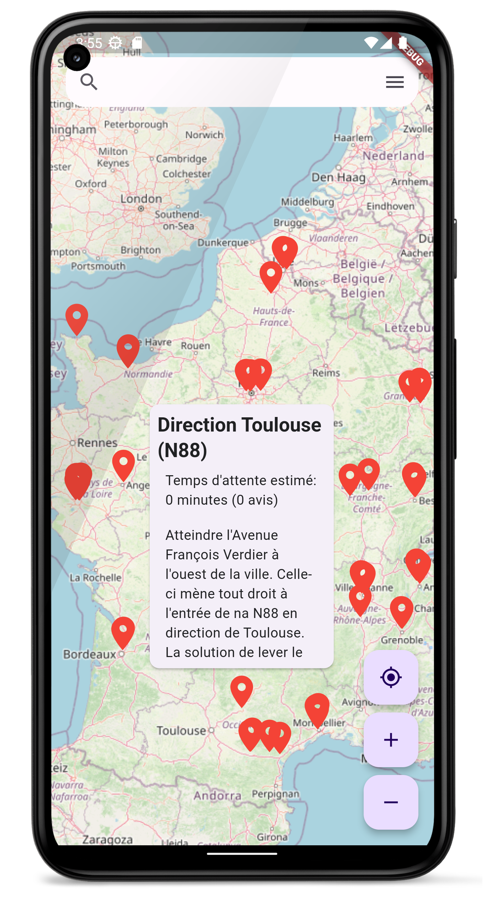
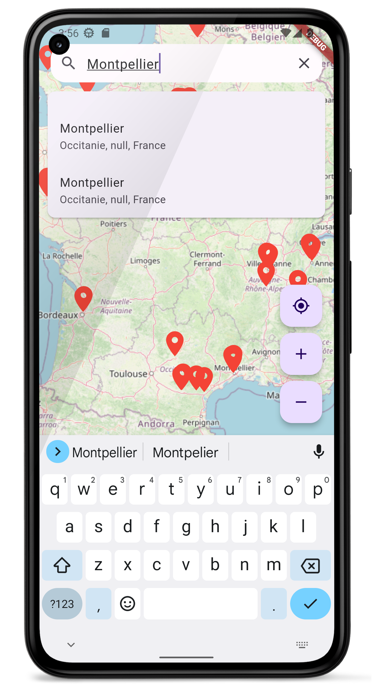
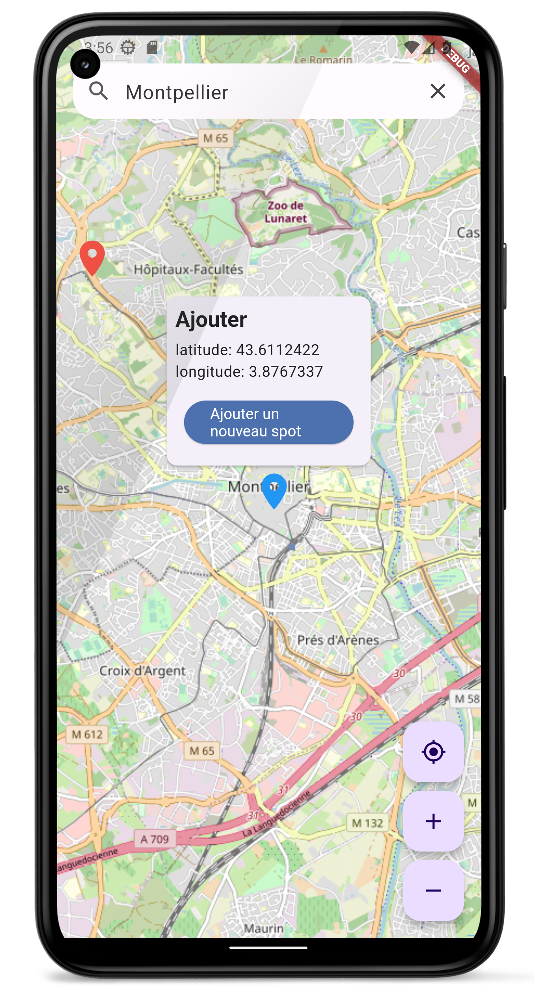

# Autostop 🚗💨

**Autostop** is an Android app designed to share, use, and create carpooling locations. Currently, the app uses Firebase, but the goal is to develop an API to remove this dependency.

---

## Table of Contents
- [Features](#features)
- [Screenshots](#screenshots)
- [Installation](#installation)
- [Configuration](#configuration)

---

## Features
- Create and share carpooling spots
- Real-time ride search
- Intuitive and responsive UI
- User and ride management
- *(Add more features as needed)*

---

## Screenshots
*(Replace with your own screenshots, hosted in a `/screenshots` folder or an external service like Imgur.)*
   Description         | Screenshot                                                                 |
 |---------------------|---------------------------------------------------------------------------|
 | Home Screen         |                                           |
 | Search spot           |                                           |
 | Add spot       |                                          |

---

## Installation

### Prerequisites
- [Flutter SDK](https://flutter.dev/docs/get-started/install) (version 3.0 or higher)
- Android Studio or an Android emulator (or a physical device with USB debugging enabled)
- Firebase account (for now)

### Steps
1. Clone this repository:
  ```bash
  git clone https://github.com/cousseaujimmy/autostop.git
  cd autostop
  ```

Install dependencies:

``` bash
flutter pub get
```

Run the app:
``` bash
flutter run
```


(If using a physical device, enable developer mode and USB debugging.)

#### The easier way is to launch it on chrome

## Configuration
### Firebase Setup

1. Create a Firebase project at firebase.google.com.
2. Add the google-services.json file to the android/app/ directory.
3. Follow the other instructions on firebase.
